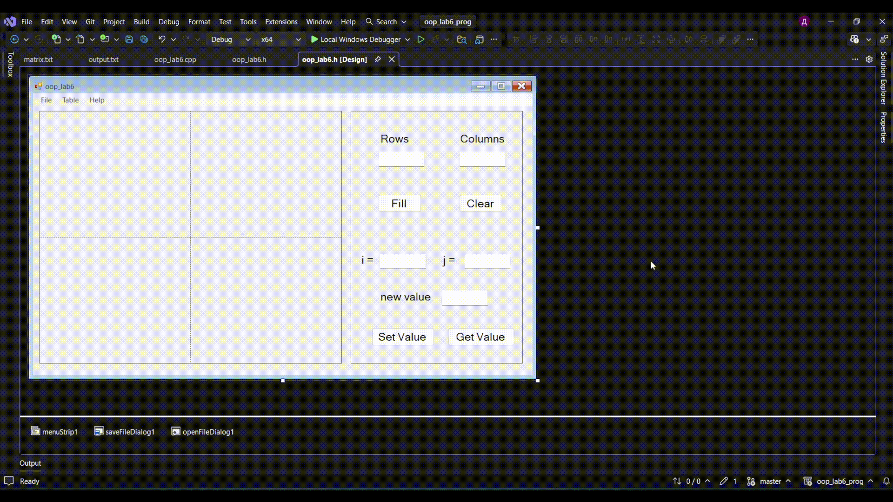
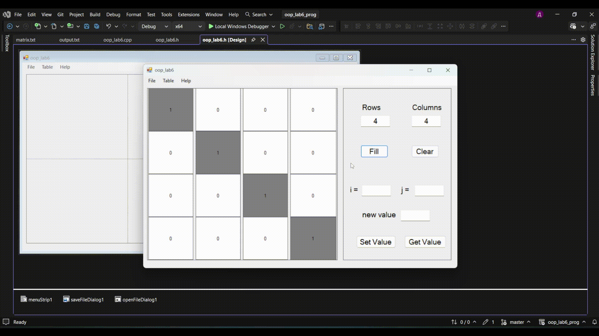
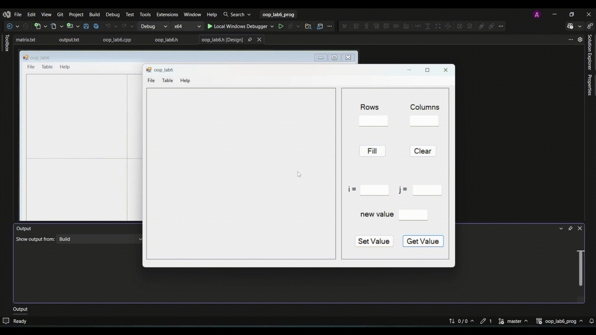
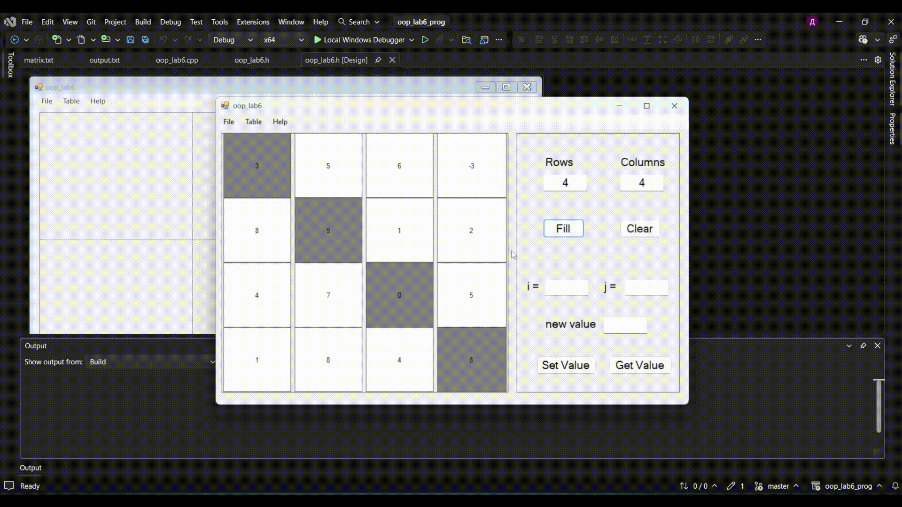
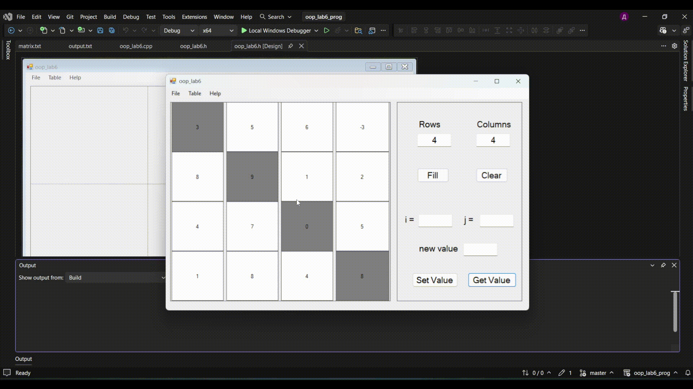
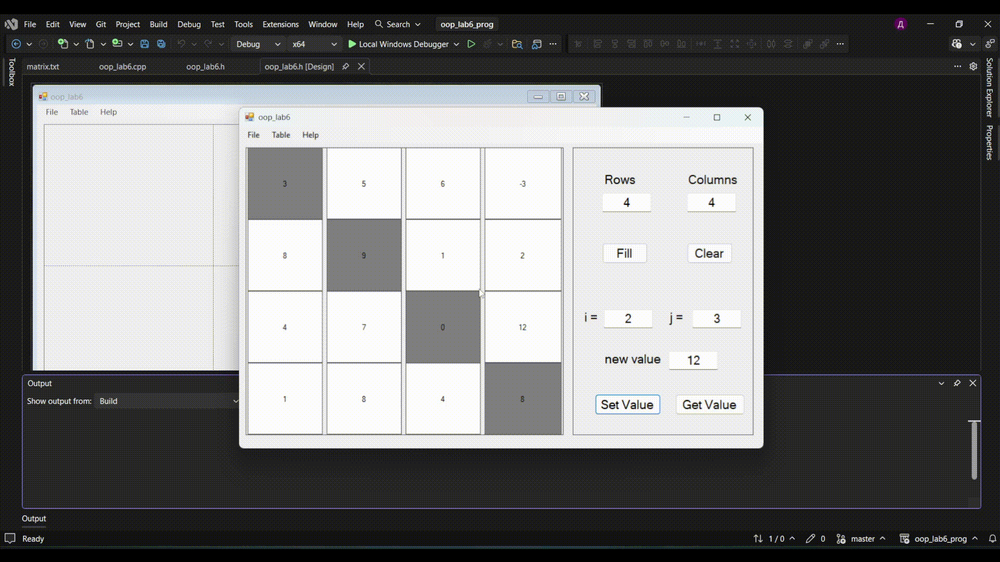

# 🖥️ My First Windows Forms Project in C++

<p align="center">
  
  
  
  
</p>

---

## 📝 Overview
Welcome to my very first **Windows Forms** application! This project marks my starting point in desktop development using **C#** and the **.NET framework**. It demonstrates the basics of UI design, event handling, and logic implementation in a Windows environment.

> [!TIP]
> This is a learning project where I explored buttons, labels, text boxes, and how they interact with backend code.

---

## ✨ Features
* **User-Friendly Interface**: Clean and simple layout.
* **Event Handling**: Practical use of click events and data processing.
* **Interactive Components**: Utilization of standard WinForms controls.
* **Responsive Logic**: Real-time feedback based on user input.

---

## 📸 Demo & Screenshots
# 💻 My First Windows Form Project in C++

This repository contains a simple Windows Forms application demonstrating table operations.  
Below are short animated explanations for each functionality.

---

## 📝 Create Table

**Instruction:** Initialize a new table with the required structure.  
Follow the steps to set up your table correctly.

<p align="center">
  
</p>

---

## 🧹 Clear Table

**Instruction:** Remove all entries from the table to start fresh.  
Use this before adding new data or testing updates.

<p align="center">
  
</p>

---

## 📂 Read Table from File

**Instruction:** Load an existing table from a saved file.  
Select the correct file to populate the table with previous data.

<p align="center">
  
</p>

---

## 🔍 Get Value

**Instruction:** Retrieve a specific value from the table.  
Use the row and column indices to access the desired cell.

<p align="center">
  
</p>

---

## ✏️ Set Value

**Instruction:** Update a value in a table cell.  
Choose the cell and enter the new value to modify the table.

<p align="center">
  
</p>

---

## 💾 Save Table to File

**Instruction:** Save the current table to a file for later use.  
Ensure you store your work before closing the application.

<p align="center">
  
</p>

---

## 🚀 How to Run
1.  **Clone the repository**:
    ```bash
    git clone [https://github.com/XkrasherX/My-first-windows-form-project-in-C-.git](https://github.com/XkrasherX/My-first-windows-form-project-in-C-.git)
    ```
2.  **Open the project**:
    Launch **Visual Studio** and open the `.sln` file.
3.  **Build and Run**:
    Press `F5` or click the **Start** button in Visual Studio.

---

## 🛠️ Tech Stack
* **Language:** C#
* **Framework:** .NET (Windows Forms)
* **IDE:** Visual Studio

---

## 📈 What I Learned
- [x] Designing UI with the Visual Studio Toolbox.
- [x] Linking UI elements to C# methods.
- [x] Basic debugging in a desktop environment.
- [x] Managing project resources and assets.

---

## 🤝 Contributing
Contributions, issues, and feature requests are welcome! Since this is a learning project, feel free to give advice or point out better ways to write the code.

---

## 👤 Author
**XkrasherX**
<p>
  <a href="https://github.com/XkrasherX">
    
  </a>
</p>


---

<p align="center">
  <i>Giving a ⭐ to this repo helps me stay motivated!</i>
</p>
